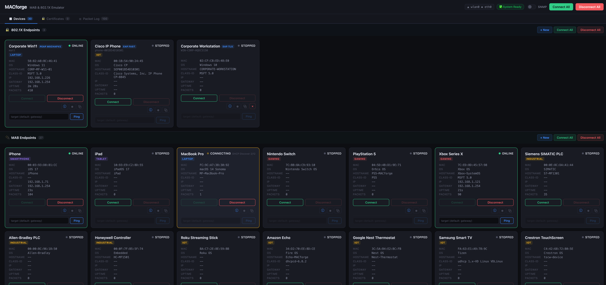
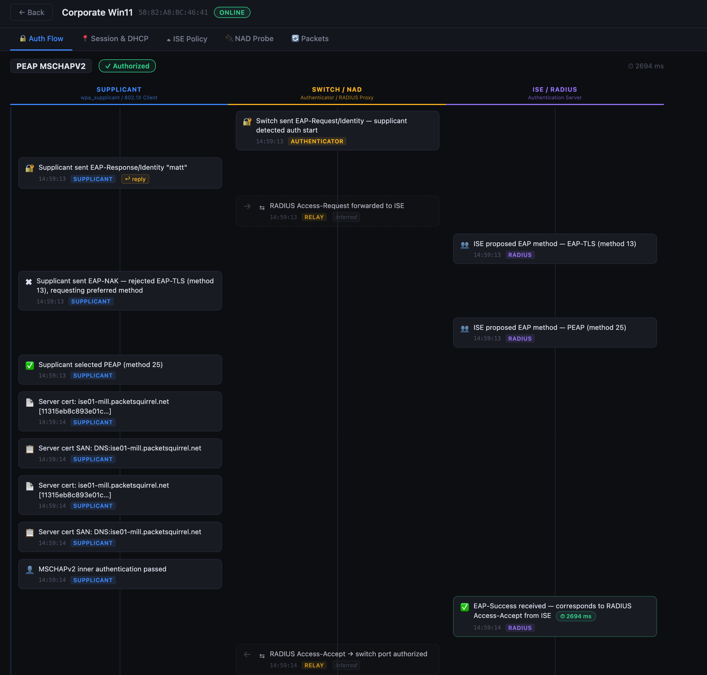
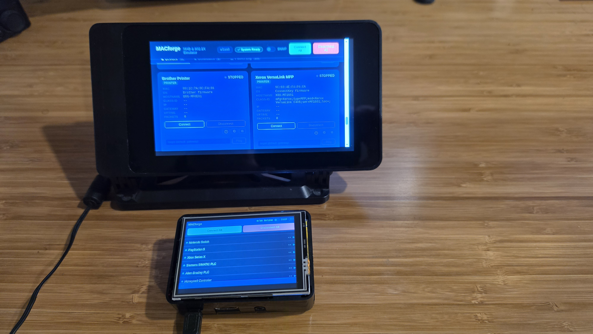

# MACforge

**MAB & 802.1X Device Emulator**

MACforge is a Docker-based tool that emulates multiple network devices by spoofing MAC addresses, generating realistic DHCP fingerprints, and performing 802.1X (dot1x) authentication. Purpose-built for testing and demonstrating RADIUS MAB/dot1x authentication and device profiling with systems like Cisco ISE.

<!---->


## What It Does

- Emulates 20+ device types (Windows, Apple, gaming consoles, IoT, printers, medical, industrial)
- Each emulated device sends traffic with a real manufacturer OUI and accurate DHCP fingerprint
- **802.1X supplicant support** -- PEAP-MSCHAPv2, EAP-TLS, EAP-FAST, EAP-TTLS, TEAP via wpa_supplicant (dual-binary: apt build for all non-TEAP methods; source-built with `CONFIG_EAP_TEAP=y` for TEAP only)
- Full DHCP lifecycle: Discover/Request on connect, Release on disconnect
- ARP keepalives + TCP SYN probes to maintain switch CAM entries and satisfy client-visibility platforms (Meraki, etc.)
- Deterministic per-host MAC addresses -- same hardware always generates the same MACs; different hardware produces different MACs
- SNMP responder for device profiling with per-device system MIB profiles
- Web UI for real-time device control, 802.1X configuration, and certificate management
- Compact touch UI for Raspberry Pi displays
- Stealth mode: drops inbound nmap probes so ISE only profiles based on crafted traffic

## Quick Start

| Environment | Start here |
|-------------|------------|
| **Raspberry Pi** (3B / 3B+ / 4B) | `bash scripts/setup-pi.sh` — installs Docker, hardens host, launches |
| **Ubuntu / Linux VM** | `bash scripts/setup-vm.sh` — installs Docker, hardens host, launches |
| **Cisco CML** | Import `labs/macforge-cml-lab.yaml` — full topology with Ubuntu node and cloud-init |
| **Existing Docker host** | Clone and run below ↓ |

```bash
git clone https://github.com/msiegy/macforge.git ~/macforge
cd ~/macforge
docker compose up -d
```

Open `http://localhost:8080` to access the web UI.

MACforge **auto-detects your network interfaces** — no configuration required for standard setups. On a host with two NICs (e.g. a Pi with wlan0 + eth0, or a VM with management + switch NIC), the NIC carrying the default route becomes the management interface and the other becomes the switch-facing data interface.

### Managing the container

All day-to-day operations use Docker Compose from the project directory:

```bash
cd ~/macforge
docker compose up -d      # start (or restart after config change)
docker compose stop       # stop gracefully
docker compose logs -f    # live log stream
docker compose down       # stop and remove container
docker compose build      # rebuild image after pulling updates
```

### Interface override (optional)

If auto-detection picks the wrong NIC (uncommon — typically only on hosts with 3+ NICs), copy the example config and set your interface names:

```bash
cp ~/macforge/.env.example ~/macforge/.env
# Edit .env: set MACFORGE_DATA_IFACE=<your-switch-NIC>
docker compose up -d
```

You can also change the active interface at runtime via the web UI interface panel without restarting the container.

### Headless / CLI mode

```bash
docker compose run --rm macforge --mode cli --start-all
```

## Device Profiles

Built-in profiles are in `profiles/`. Each YAML file defines one or more devices:

```yaml
- name: "Nintendo Switch"
  mac: "7C:BB:8A:AB:06:01"     # Hardcoded, deterministic MAC (Nintendo OUI)
  personality:
    category: "gaming"
    os: "Nintendo Switch OS"
    device_type: "Nintendo Switch"
  dhcp:
    hostname: ""
    vendor_class: ""            # option 60 (class-id)
    client_id: "mac"            # option 61 = 01:<mac>
    options_order: [53, 61, 55] # order options appear in the packet
    param_request_list: [1, 3, 6, 28]  # option 55 (primary fingerprint)
  traffic_interval_sec: 30
```

### Customizing Profiles

- Edit existing YAML files or add new ones to `profiles/`
- Mount a custom profiles directory: `-v /path/to/my/profiles:/app/profiles:ro`
- OUI prefixes match real manufacturers (Nintendo, Sony, Apple, HP, etc.)
- MACs are deterministic per-host -- see [MAC Address Generation](#mac-address-generation) below

### Built-in Device Categories

| Category | Devices |
|----------|---------|
| Windows | Windows 10 Desktop, Windows 11 Laptop |
| Apple | iPhone, iPad, MacBook Pro |
| Gaming | Nintendo Switch, PlayStation 5, Xbox Series X |
| IoT | Roku, Amazon Echo, Google Nest, Samsung Smart TV |
| Printers | HP LaserJet, Brother MFC |
| Linux | Ubuntu Server, RHEL Server |
| Medical | Philips Patient Monitor, BD Alaris Infusion Pump |
| Industrial | Siemens SIMATIC PLC, Allen-Bradley PLC, Honeywell Controller |
| 802.1X | Corporate Win11 (PEAP), iPhone 15 (PEAP), Cisco IP Phone (EAP-FAST) |

## 802.1X (dot1x) Support

MACforge can act as an 802.1X supplicant using `wpa_supplicant`, supporting:

- **PEAP-MSCHAPv2** -- username/password with optional server cert validation
- **EAP-TLS** -- certificate-based mutual authentication
- **EAP-FAST** -- with PAC auto-provisioning
- **EAP-TTLS** -- tunneled authentication with inner methods (MSCHAPv2, GTC, PAP, etc.)
- **TEAP** -- experimental; MSCHAPv2 inner method only (requires the source-built binary compiled into the container)

All credentials and certificates are configured directly in the web UI -- click the "802.1X" button on any device card. Changes persist across container restarts via the `data` volume.

### How It Works

For dot1x devices, MACforge creates a temporary macvlan interface per device (automatically), runs `wpa_supplicant` for EAP authentication, then proceeds to DHCP on the main interface. MAB devices continue to use Scapy directly and are unaffected.

### Generating Test Certificates

For EAP-TLS testing, generate a self-signed CA and client cert:

```bash
bash scripts/gen-lab-certs.sh
```

This outputs `lab-ca.pem`, `client.pem`, and `client.key` into `~/macforge/data/certs/`, making them immediately available in the web UI certificate selector. You can also upload or paste PEM certificates directly in the UI.

## Web UI

The dashboard at `http://<host>:8080` provides:

- Device cards with current state (Stopped / Connecting / Authenticating / Online / Auth Failed)
- Auth method badges on dot1x devices (PEAP, EAP-TLS, etc.)
- 802.1X configuration drawer with method-dependent form fields
- Certificate upload (drag-and-drop) and PEM paste modal
- Per-device Connect/Disconnect buttons
- Connect All / Disconnect All batch controls
- ICMP ping with custom targets per device
- Live packet log (DHCP, ARP, EAPOL, mDNS, SSDP events)
- SNMP responder toggle
- Device fingerprint details (MAC, hostname, vendor class, IP)

## MAC Address Generation

MACforge generates **deterministic, per-host MAC addresses**. Each emulated device keeps its vendor OUI (first 3 bytes) for realistic profiling, but the last 3 bytes are derived from the host NIC's hardware MAC address. This means:

- **Same hardware = same MACs** -- survives container rebuilds, reinstalls, and reboots
- **Different hardware = different MACs** -- no collisions when running multiple MACforge instances on different hosts
- **OUIs preserved** -- ISE/RADIUS still sees the correct manufacturer (Apple, HP, Nintendo, etc.)

The seed is computed at startup and logged with a fingerprint (first 8 hex chars). You can verify it via the API:

```bash
curl -s http://localhost:8080/api/interface | python3 -m json.tool
# Returns: { "interface": "eth0", "mac": "...", "ip": "...", "seed_fingerprint": "a1b2c3d4" }
```

Hovering over the interface badge in the web UI also shows the seed fingerprint.

### Multiple Instances on the Same Hardware

If you run multiple MACforge containers on the same host (e.g. different switch ports), set `MACFORGE_INSTANCE_ID` in each instance's `.env` to give each unique MACs:

```bash
# Clone a second copy for the second port
git clone https://github.com/msiegy/macforge.git ~/macforge-port2
cd ~/macforge-port2

# Create a .env with a unique instance ID and the correct NIC
cp .env.example .env
# Set: MACFORGE_DATA_IFACE=eth1
#      MACFORGE_INSTANCE_ID=port2

docker compose up -d
```

Without `MACFORGE_INSTANCE_ID`, all instances on the same host NIC produce identical MACs.

### Manually Assigned MACs

You can still assign a specific MAC to any device via the web UI (edit device → enter a MAC manually). Manually assigned MACs are stored as-is and are not remapped.

## Switch Port Configuration

The switch port connected to the MACforge host must be configured for MAB and/or dot1x. For multiple simultaneous devices, use multi-auth mode:

```
interface GigabitEthernet1/0/1
 switchport mode access
 switchport access vlan 100
 authentication host-mode multi-auth
 authentication port-control auto
 authentication order dot1x mab
 authentication priority dot1x mab
 mab
 dot1x pae authenticator
```

With `authentication order dot1x mab`, the switch tries 802.1X first. If the endpoint responds with EAPOL, dot1x auth proceeds. If not, the switch falls back to MAB. This lets MACforge run both dot1x and MAB devices on the same port.



## Environment Setup

One-command setup scripts are provided for common environments. Both scripts handle Docker install, service hardening (lldpd, avahi-daemon), interface detection, and container launch with auto-restart.

### Raspberry Pi (3B / 3B+ / 4B)

```bash
git clone https://github.com/msiegy/macforge.git ~/macforge
bash ~/macforge/scripts/setup-pi.sh
```

Add `--kiosk` to also install X/Chromium and auto-launch the touch UI on an attached display. See [docs/RASPBERRY_PI.md](docs/RASPBERRY_PI.md) for full details including manual step-by-step and cross-build instructions.

### Linux VM / Ubuntu Host

Supports Ubuntu 22.04/24.04, Debian 12, Rocky Linux 9 / RHEL 9:

```bash
git clone https://github.com/msiegy/macforge.git ~/macforge
bash ~/macforge/scripts/setup-vm.sh
```

The script also handles NetworkManager unmanaging the switch-facing NIC so it doesn't conflict with wpa_supplicant. See [docs/DEPLOYMENT.md](docs/DEPLOYMENT.md) for detailed options including macvlan networking and Docker Compose.

> **VM networking note**: The NIC used for MAB/802.1X must be in **Bridged** mode (VMware/VirtualBox) or attached to a bridge connected to the physical NIC (KVM/libvirt). NAT interfaces will not work — raw 802.1X and MAB frames must reach the switch port directly.

### Cisco CML

Import [`labs/macforge-cml-lab.yaml`](labs/macforge-cml-lab.yaml) into your CML instance. The topology includes a pre-configured Ubuntu node with cloud-init that clones the repo and runs `setup-vm.sh` automatically on first boot — no manual steps required. The lab bridges to your CML external connector for internet access and connects the Ubuntu node to a Catalyst switch for switch-port testing.

## Host Preparation

> The `setup-pi.sh` and `setup-vm.sh` scripts handle all of the below automatically. These steps are only needed for manual installs.

- **Disable lldpd**: If the Docker host runs `lldpd`, disable it so the host's own LLDP frames don't cause ISE to profile based on the host instead of the emulated devices.
- **Disable avahi-daemon**: The host's own mDNS announcements can confuse ISE device profiling. Disable it on the MAB testing host.
- **Fix ARP flux**: If the host has both wired (`eth0`) and wireless (`wlan0`) interfaces, Linux will respond to ARP requests for wlan0's IP on eth0 by default. This causes switches/Meraki to see a phantom client with the wired MAC but the WiFi IP. For manual installs, apply: `sysctl -w net.ipv4.conf.all.arp_announce=2 net.ipv4.conf.all.arp_filter=1`
- **Capabilities**: The container requires `NET_RAW`, `NET_ADMIN`, and `--privileged`. `--privileged` is required for `ip link add ... type macvlan` (used by 802.1X/dot1x devices). MAB-only setups can omit it, but `--privileged` is always safest.

## CLI Options

```
macforge [OPTIONS]

Options:
  --mode {web,cli}           Run mode (default: web)
  --interface, -i TEXT       Management interface — web UI binds here (default: auto-detected)
  --data-interface, -d TEXT  Data/NAD interface — EAP/MAB/DHCP frames sent here (default: auto-detected)
  --profiles-dir, -p DIR     Profiles directory (default: built-in)
  --port INT                 Web UI port (default: 8080)
  --host TEXT                Web UI bind address (default: 0.0.0.0)
  --start-all                CLI mode: connect all devices on startup
  --verbose, -v              Debug logging
```

On hosts with two physical NICs, both interfaces are auto-detected: the NIC with the default gateway becomes the management interface, the other becomes the data interface. Use `MACFORGE_IFACE` and `MACFORGE_DATA_IFACE` environment variables as an alternative to the CLI flags (useful in `docker-compose.yml`).

## API Reference

The REST API is consumed internally by the web UI. The endpoints below are the most useful for debugging and scripting from outside the UI:

| Method | Path | Description |
|--------|------|-------------|
| GET | `/api/devices` | List all devices with current status |
| POST | `/api/devices/{mac}/connect` | Connect a device (EAP auth + DHCP or MAB) |
| POST | `/api/devices/{mac}/disconnect` | Disconnect (DHCP Release + EAPOL Logoff) |
| POST | `/api/devices/connect-all` | Connect all stopped devices |
| POST | `/api/devices/disconnect-all` | Disconnect all active devices |
| GET | `/api/devices/{mac}/auth` | Get 802.1X config for a device |
| PUT | `/api/devices/{mac}/auth` | Set/update 802.1X config |
| DELETE | `/api/devices/{mac}/auth` | Remove 802.1X config (revert to MAB) |
| GET | `/api/dot1x/readiness` | Probe all EAP method binaries and report status |
| GET | `/api/logs?limit=N` | Recent packet log entries |
| GET | `/api/interface` | Active interface info and MAC seed fingerprint |
| GET | `/api/interfaces` | All available network interfaces on the host |

Full API documentation (all 50+ routes) is in [docs/architecture.md](docs/architecture.md).

## Troubleshooting & Debugging

### Inspect stored endpoint configuration

Auth configs persist in the data volume whether devices are connected or not:

```bash
# All 802.1X configs
cat ~/macforge/data/auth_config.json

# Single device via API (MAC with dashes)
curl -s http://localhost:8080/api/devices/18-03-73-09-F1-31/auth

# All device states (IP, auth state, method, etc.)
curl -s http://localhost:8080/api/devices

# Uploaded certificates
ls -la ~/macforge/data/certs/
```

### Inspect a specific endpoint — stored config vs. live config

Two different sources of truth depending on whether the device is connected:

**Stored config** (persistent, available at all times — keyed by MAC with colons):

```bash
# Via API — cleanest one-liner, MAC with dashes (works from any machine on the network)
curl -s http://macforge.local:8080/api/devices/18-03-73-09-F1-31/auth

# Or grep directly on the file — auth_config.json is pretty-printed, so context works
grep -A 25 "18:03:73:09:F1:31" ~/macforge/data/auth_config.json

# Full file (all devices)
cat ~/macforge/data/auth_config.json
```

**Live wpa_supplicant config** (generated on connect, gone on disconnect):

The interface name is `mf` + MAC with no colons: `18:03:73:09:F1:31` → `mf18037309F131`

```bash
# Show the exact config wpa_supplicant received (only while device is connected)
docker exec macforge cat /tmp/macforge_wpa/mf18037309F131.conf

# Show the wpa_supplicant log (EAP state machine, TLS handshake, etc.)
docker exec macforge cat /tmp/macforge_wpa/mf18037309F131.log

# List all active wpa_supplicant sessions (one entry per connected 802.1X device)
docker exec macforge ls -la /tmp/macforge_wpa/
```

The `.conf` file is the authoritative view of what wpa_supplicant actually ran with —
if the stored config and the live conf differ, there is a bug in `generate_wpa_conf()`.
The `.log` file shows the full EAP state machine: TLS record types, inner method
negotiation, and the final `EAP SUCCESS` or `EAP FAILURE`.

**Compute the interface name for any MAC:**

```bash
# Replace the MAC with your device's MAC
MAC="18:03:73:09:F1:31"
echo "mf${MAC//:/}"
# → mf18037309F131
```

### Check what EAP methods each binary supports

```bash
# apt binary — lists compiled-in EAP methods at startup
docker exec macforge /usr/sbin/wpa_supplicant -v 2>&1 | grep -A 30 "EAP methods"

# source-built binary (TEAP) — confirm CONFIG_EAP_TEAP=y is present
docker exec macforge /usr/local/sbin/wpa_supplicant_teap -v 2>&1 | grep -E "TEAP|EAP methods"

# Run the full readiness probe (tests all 5 EAP methods, takes ~15s)
curl -s http://localhost:8080/api/dot1x/readiness | python3 -m json.tool
```

### Inspect certificates

```bash
# What certs are in the store
docker exec macforge ls -la /app/data/certs/

# Read a cert's subject, issuer, validity
docker exec macforge openssl x509 -noout -subject -issuer -dates \
  -in /app/data/certs/lab-ca.pem

# Verify a client cert was signed by the CA
docker exec macforge openssl verify \
  -CAfile /app/data/certs/lab-ca.pem \
  /app/data/certs/client.pem

# Check a cert/key pair match (the public key modulus must be identical)
docker exec macforge openssl x509 -noout -modulus -in /app/data/certs/client.pem | md5sum
docker exec macforge openssl rsa  -noout -modulus -in /app/data/certs/client.key  | md5sum
```

### Watch live logs

```bash
# All MACforge log output — most useful during connect/disconnect
cd ~/macforge && docker compose logs -f

# Filter to a single device by MAC
docker compose logs -f 2>&1 | grep "18:03:73:09:F1:31"

# Filter to auth/EAP events only
docker compose logs -f 2>&1 | grep -E "EAP|dot1x|wpa_supplicant|auth|RADIUS"

# See active macvlan interfaces (one per connected 802.1X device)
docker exec macforge ip link show | grep "mf[0-9a-f]"
```

### Capture packets on the wire (EAPOL / DHCP / ARP)

```bash
# EAPOL frames — the raw 802.1X conversation (EAP-Request/Response, EAP-Success)
sudo tcpdump -i eth0 -e -n ether proto 0x888e

# DHCP — confirm spoofed MACs appear as source in Discover/Request
sudo tcpdump -i eth0 -e -n 'udp port 67 or udp port 68'

# ARP — keepalives and address announcements
sudo tcpdump -i eth0 -e -n arp

# TCP SYN keepalive probes (primary client-visibility traffic)
sudo tcpdump -i eth0 -e -n 'tcp[tcpflags] & tcp-syn != 0'

# All MACforge traffic (EAPOL + DHCP + ARP + TCP SYN)
sudo tcpdump -i eth0 -e -n 'ether proto 0x888e or udp port 67 or udp port 68 or arp or (tcp[tcpflags] & tcp-syn != 0)'

# Write a capture for Wireshark analysis
sudo tcpdump -i eth0 -w /tmp/macforge-capture.pcap \
  'ether proto 0x888e or udp port 67 or udp port 68 or arp'
```

The `-e` flag prints the source MAC on each frame — you'll see the spoofed device
MACs (Nintendo, Windows, HP, etc.) as source addresses, not the Pi's real MAC.

### Capture on a specific macvlan interface (802.1X device only)

Each 802.1X device gets its own macvlan. Capturing on it shows only that device's
EAPOL exchange, cleanly separated from other devices:

```bash
# Replace mf18037309F131 with the interface for your device
sudo tcpdump -i mf18037309F131 -e -n ether proto 0x888e -v
```

The `-v` flag on tcpdump decodes the EAP type field and inner method identifiers,
showing you `EAP TLS`, `EAP PEAP`, the challenge/response lengths, and whether it
ended in `Success` or `Failure` at the EAPOL layer.

### Decode what's in an EAPOL frame (Wireshark alternative)

For a quick field-level decode without Wireshark, `tshark` (CLI Wireshark):

```bash
# Install on the Pi
sudo apt install tshark -y

# Live decode of EAPOL — shows EAP type, identity, TLS record types
sudo tshark -i eth0 -Y eapol -T fields \
  -e eth.src -e eth.dst -e eap.code -e eap.type -e eap.identity 2>/dev/null
```

### Quick health check sequence

Run these in order when something isn't working:

```bash
# 1. Is the container running?
docker ps | grep macforge

# 2. Any startup errors?
docker logs macforge 2>&1 | tail -30

# 3. Is the correct interface being used?
docker logs macforge 2>&1 | grep -E "interface|eth"

# 4. Are stealth iptables rules applied?
docker exec macforge iptables -L INPUT -n | head -10

# 5. Can the apt binary do EAP-TLS? (should list TLS in EAP methods)
docker exec macforge /usr/sbin/wpa_supplicant -v 2>&1 | grep TLS

# 6. Can the source binary do TEAP? (should list TEAP in EAP methods)
docker exec macforge /usr/local/sbin/wpa_supplicant_teap -v 2>&1 | grep TEAP
```
**Macforge on Raspberry Pi3 B**


